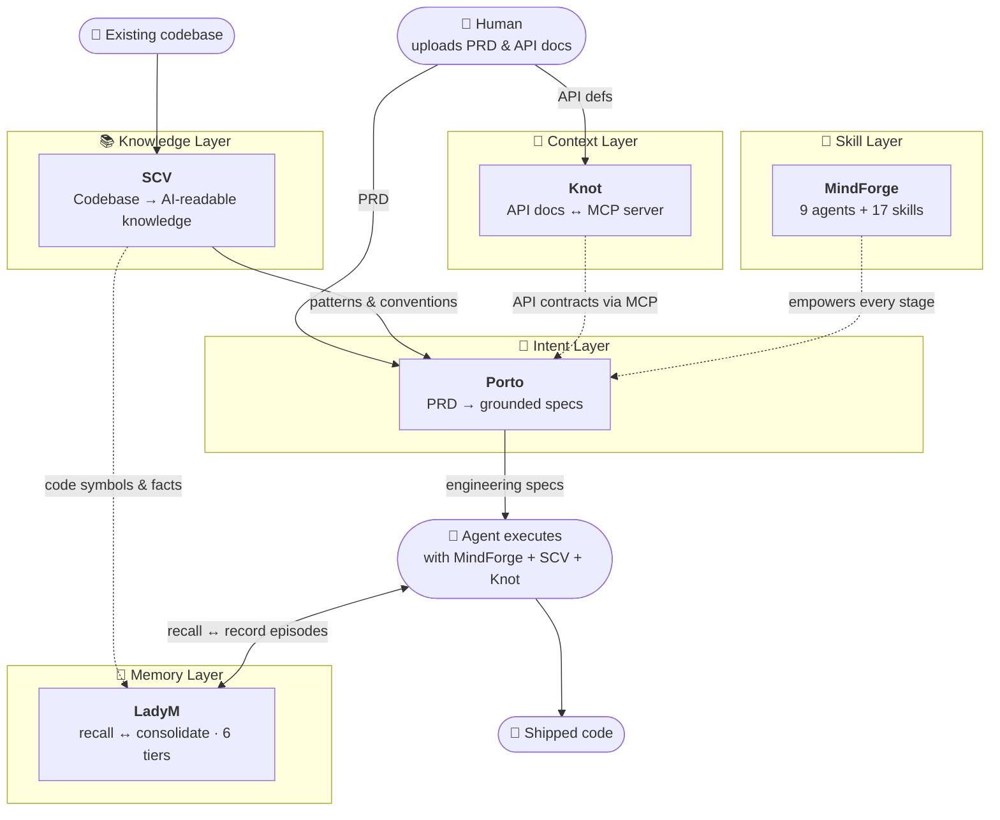

<div align="center">

# ⚒️ ProjAnvil

### Infrastructure for the Agent Era

**We build the tooling a team needs to be genuinely productive when AI agents write the code.**

[](https://opensource.org/licenses/MIT)
[](https://claude.com/claude-code)
[](#-the-stack)
[](https://modelcontextprotocol.io)

</div>

---

## 🌍 The shift we're building for

The unit of a developer's capability is changing — fast.

| | What "being skilled" meant |
|---|---|
| **Yesterday** | The languages × frameworks × toolchains you mastered by hand |
| **Today** | **The quality of the agent configuration you carry** |

Claude Code and its peers are no longer demos — they're in real engineering teams. The Agent Skills standard is now supported by 25+ frameworks. A whole product can collapse into *one agent plus a thin front-end shell*.

We don't think this is the future. **It's the present.** ProjAnvil is our answer to a single question:

> *What infrastructure does a team actually need to ship software when an agent is the one writing it?*

---

## 🧩 The insight: three elements define an agent's ceiling

Every agent's potential is set by three things — and most teams are leaving two of them empty.

| Element | Decides | ProjAnvil's question |
|---|---|---|
| 🛠️ **Command** | What an agent can *do* | *"Where are its boundaries?"* |
| 🧠 **Skill** | What an agent *knows* | *"How deep is its expertise?"* |
| 🔌 **MCP** | What an agent can *connect to* | *"Which of our systems can it reach?"*

We discovered that filling these three axes — with **quality over quantity** — changes everything. One precise, compliant skill beats ten generic ones. ProjAnvil is a coordinated toolkit that strengthens each axis, plus the SDKs to build your own.

---

## 🏛️ The architecture at a glance

A complete pipeline for agent-era development — **intent → knowledge → context → execution** — plus a memory layer that recalls it all instead of re-reading. Each layer has one job and does it well.



---

## 🧰 Meet the toolkit

### 🧠 Skill Layer — [MindForge](https://github.com/ProjAnvil/MindForge)
*A complete capability toolkit for Claude Code — the "app store" of agent expertise.*

The most-starred repo in the org. Ships **9 specialized agents** (code reviewer, frontend engineer, Go/Java/Python engineers, iOS developer, system architect, product manager, test engineers) and **17 composable skills** (API design, database design, system architecture, testing, Git mastery, frontend stacks, and more), plus extensible **MCP services**. One-command install, bilingual (English / 简体中文), template-based creation. Built on a clean separation: *agents define **who** acts, skills define **what** they know, MCP defines **what they reach**.

> **Why:** Generic agents plateau fast. Depth in vertical domains is what turns an assistant into a teammate.

### 📚 Knowledge Layer — [SCV](https://github.com/ProjAnvil/SCV) (Source Code Vault)
*Turn any codebase into structured knowledge an agent can actually reason over.*

SCV analyzes repositories and emits **four purpose-built documents** — `README.md` (positioning & quick-start), `SUMMARY.md` (5-minute briefing), `ARCHITECTURE.md` (Mermaid diagrams & rationale), and `FILE_INDEX.md` (file-by-file responsibility map). Runs single repos or entire portfolios in parallel via isolated subagents, with incremental skips, auto-pull, and crash recovery. Optional `codebones` deep-analysis mode strips code to its skeleton (~85% token reduction).

> **Why:** An agent that doesn't understand your existing patterns will reinvent them — badly. Your team's real asset is its conventions; SCV makes them legible to machines.

### 🎯 Intent Layer — [Porto](https://github.com/ProjAnvil/Porto)
*A codebase-aware requirements workbench that turns PRDs into grounded engineering specs.*

Porto doesn't hallucinate boilerplate. It retrieves context from an SCV-built knowledge base, then drives each spec through a **generate → critique → refine loop** scored on a 12-point rubric (template-grade specs climb from ~3.2 to ~11.4). Every retrieval, tool call, and rework decision is recorded for traceability. And it runs **end-to-end with zero API keys** — deterministic fallbacks mean the model is a quality amplifier, not an on/off switch.

> **Why:** The gap between "what product asked for" and "what engineering can build" is where projects bleed. Porto closes it with specs that reference *your* modules, not invented ones.

### 🔌 Context Layer — [Knot](https://github.com/ProjAnvil/Knot)
*An API documentation hub that's as readable by AI as it is by humans.*

Knot organizes endpoints into searchable, Markdown-rich groups with drag-and-drop ordering, fuzzy search, and JSON highlighting. Its distinguishing trick is a built-in **MCP server**: Claude can list groups, search APIs, pull detailed docs, and generate request/response examples through natural language. Go backend + Svelte 5 frontend compiled into **a single zero-dependency binary**, with SQLite / PostgreSQL / MySQL backends.

> **Why:** API docs that only render in a browser are dead weight in the agent era. If an agent can't query your contracts, it can't integrate with them.

### 🧬 Memory Layer — [LadyM](https://github.com/ProjAnvil/LadyM)

*A brain-inspired, multi-tier memory that lets an agent **recall** workspace knowledge with one keyword — instead of re-`Read`-ing and re-`Grep`-ing the same files every turn.*

Today's coding agents have no long-term memory: every turn they rediscover the same symbols and burn the context window on rediscovery. LadyM caches the workspace's *understanding* — code analysis, decisions, skills, and episodes — into a hierarchical, consolidating, decaying memory any agent can recall through a single keyword. Its distinctive bet is **fusing codebase RAG into a brain-inspired memory**: L2 stores tree-sitter code symbols and plain facts in *one* store, scored by one ACT-R activation function — memory and codebase search are one system, not two. L0–L4 form the online store (working / episodic / semantic / procedural / associative); a System 2 worker asynchronously distills **L5 mental models** and **L6 forward intents**, with a `supersedes` chain so memories *evolve* instead of piling up. Local-first by default — `HashingEmbedding` + SQLite + `sqlite-vec`, **no network, no model download, no API key** to start. Exposed via **MCP server, Claude Code Skill, Python SDK, and CLI**, all calling the same engine; the read path is heuristic-only, so recall stays fast and predictable. 267 tests, fully offline.

> **Why:** An agent that re-discovers your codebase every turn is an amnesiac wearing a nametag. Memory is what turns a one-shot assistant into a teammate that gets smarter the longer it works in your repo.

---

## 🧱 Foundations — build your own agent stack in Go

### [claude-agent-sdk-golang](https://github.com/ProjAnvil/claude-agent-sdk-golang)
An idiomatic **Go port of Anthropic's Claude Agent SDK** (Python). Wraps the Claude Code CLI to offer one-shot `Query()`/`QuerySync()` channels, an interactive `ClaudeSDKClient`, in-process MCP tools, hooks (e.g. blocking dangerous bash), agent definitions, configurable thinking budgets, sandboxing, and full session management (resume / import / mutations / store / summary). Mirrors the Python SDK's surface so Go teams can build agents without leaving their stack.

### [langchain-golang](https://github.com/ProjAnvil/langchain-golang)
A community **Go port of LangChain** — `core/` (messages, runnables/LCEL, tools, prompts, output parsers, vector stores, retrievers, callbacks, streaming), `langchain/` (`CreateAgent` with 15 middleware modules, structured output, interrupts/resume, subagents), `textsplitters/`, and partner integrations for **OpenAI, Anthropic, Ollama, and Chroma**. 920+ tests passing across 51 packages. Preview quality (v0.3.x), MIT, not affiliated with LangChain, Inc.

> **Why:** The Go ecosystem deserved first-class agent primitives — not a "just call Python" workaround.

---

## 🔧 Tooling — scaffold and seed

### [Belt](https://github.com/ProjAnvil/Belt)
Scaffolds **AI-native apps for Claude Code** — not plugins, webhooks, or wrappers, but tools that live *inside* the agent's context. `belt new` walks you through building a four-part bundle (Skill `SKILL.md` + executable Script + subagent + reusable Component), bilingual by default, with one-command install into `~/.claude/`. Includes a component system where logic is pytest-verified before the AI ever touches it.

> **Why:** "A product is an agent plus a thin shell." Belt is the fastest way to build that shell.

### [Jiade](https://github.com/ProjAnvil/Jiade)  *(假的 — "simulated")*
Generates **runnable microcosms** of real-world industry systems — complete, small-scale architectures for learning, demos, integration testing, and tooling experiments. The bundled **bank template** spins up 7 Go microservices and 7 PostgreSQL databases on a single instance, with deterministic seed data (same seed → byte-identical rows), three-factor event streams, and cross-database federation via `postgres_fdw`. Self-contained output runs with just Docker and Go.

> **Why:** Agents need realistic systems to build against. Jiade gives you a believable bank, reproducibly, in one command.

---

## 📊 Applications — built on the stack

### [Bossy](https://github.com/ProjAnvil/Bossy)
*A self-hosted, privacy-first ChatBI platform.*

Ask questions in plain language and get SQL, tables, and charts over your own databases — without your data ever leaving your infrastructure. Bring-your-own-LLM (a fully local model via Ollama, or any OpenAI-/Anthropic-compatible endpoint), a rule-based semantic layer, SQL guard, and EXPLAIN-based cost gate keep the deterministic parts predictable, while an 8-role LLM agent pipeline (intent, planning, SQL gen/rewrite, insight, …) handles the rest. Python/FastAPI backend + Next.js frontend, ships with a synthetic banking demo dataset generated with Faker.

> **Why:** The best proof of an agent stack is a real product built on it. Bossy shows the toolkit paying off end-to-end — a working, self-hosted ChatBI app where your data never has to leave your infrastructure.

---

## 🤝 How a team uses it together

**The human** does what humans do best — *intent and judgment*:

```
 💾 Existing code  ──►  SCV  ──►  structured knowledge base
 📄 PRD document   ──►  Porto ──►  grounded engineering specs
 🔗 API definitions ──►  Knot  ──►  AI-readable API context
```

**The agent** does the rest — *execution* — equipped with all three axes filled:

```
        ┌─────────────┐  ┌─────────────┐  ┌─────────────┐  ┌─────────────┐
        │  MindForge  │  │     SCV     │  │   Knot MCP  │  │    LadyM    │
        │  domain     │  │  code       │  │  API        │  │  evolving   │
        │  expertise  │  │  knowledge  │  │  contracts  │  │   memory    │
        └──────┬──────┘  └──────┬──────┘  └──────┬──────┘  └──────┬──────┘
               └────────────────┼────────────────┼────────────────┘
                                        ▼
                            ┌─────────────────────┐
                            │  Understands the    │
                            │  spec → writes code │
                            │  → reviews → tests  │
                            └─────────────────────┘
```

The result: specs stop being guesswork, code stops reinventing your conventions, APIs stop being invisible to the agent writing against them, and nothing the agent learned last turn has to be rediscovered.

---

## 🎯 Why we built ProjAnvil

We kept watching talented teams adopt coding agents and hit the same three walls: **the agent didn't know their domain, didn't know their codebase, and couldn't reach their systems.** Most "AI productivity" effort goes into prompting. We think the bigger leverage is in **infrastructure** — filling the Skill, Knowledge, Context, and Memory axes so any agent becomes dramatically more useful, immediately.

ProjAnvil is that infrastructure, built in the open, MIT-licensed, and dogfooded on every project we ship. We're betting that the teams who win the next decade won't be the ones with the most coders — they'll be the ones with the **deepest, most proprietary agent configurations**.

---

## 📇 Full repo index

| Repo | Role | Language | What it does |
|------|------|----------|--------------|
| [MindForge](https://github.com/ProjAnvil/MindForge) | 🧠 Skill | Go | 9 agents + 17 skills + MCP services for Claude Code |
| [SCV](https://github.com/ProjAnvil/SCV) | 📚 Knowledge | Python | Codebase → 4 structured, AI-readable documents |
| [Porto](https://github.com/ProjAnvil/Porto) | 🎯 Intent | Python | PRD → grounded, self-refining engineering specs |
| [Knot](https://github.com/ProjAnvil/Knot) | 🔌 Context | Go · Svelte | API docs hub with a built-in MCP server |
| [LadyM](https://github.com/ProjAnvil/LadyM) | 🧬 Memory | Python | Brain-inspired multi-tier memory + codebase RAG |
| [claude-agent-sdk-golang](https://github.com/ProjAnvil/claude-agent-sdk-golang) | 🧱 Foundation | Go | Go port of Anthropic's Claude Agent SDK |
| [langchain-golang](https://github.com/ProjAnvil/langchain-golang) | 🧱 Foundation | Go | Community Go port of LangChain |
| [Belt](https://github.com/ProjAnvil/Belt) | 🔧 Tooling | Python | Scaffolds AI-native apps for Claude Code |
| [Jiade](https://github.com/ProjAnvil/Jiade) | 🔧 Tooling | Go | Generates runnable miniature industry systems |
| [Bossy](https://github.com/ProjAnvil/Bossy) | 📊 Application | Python · TypeScript | Self-hosted, privacy-first natural-language BI over your databases |

<div align="center">

---

*Quality over quantity. One precise skill beats ten generic ones.*

*Built by humans, for agents. ⚒️*

</div>
